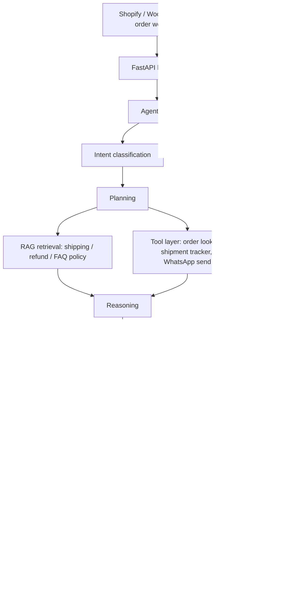

# AI support operations platform — master project document

**Purpose of this document:** the single source of truth. Case scenario, business flow, technical architecture, every phase and sub-phase, every GenAI/agentic AI concept mapped to where it's built, and the coding workflow. Nothing about scope or sequencing should need re-discussing after this.

**Real-world target:** a WhatsApp agent that confirms COD (cash-on-delivery) orders and reduces RTO (return-to-origin/reject rate) for Shopify/WooCommerce sellers in Pakistan, where COD is ~85–95% of orders and RTO routinely hits 25–40%.

**Current status:** Phase 1 (data) ✅ done — synthetic order/customer data generated. Phase 2 (RAG) 🔄 in progress. Everything below Phase 2 is upcoming.

---

## 1. Case scenario — how it works for a real customer

> Ayesha runs a clothing store on Shopify in Lahore. A customer, Bilal, orders a dress worth Rs. 3,200, COD.
>
> 1. Order placed → webhook fires → agent sends Bilal a WhatsApp message confirming item, price, and address.
> 2. Bilal replies: *"delivery kab tak hoga?"* — a question, not a confirmation.
> 3. Agent retrieves the shipping policy (RAG), answers with the delivery window, and asks him to confirm.
> 4. Bilal replies *"haan confirm hai"* — agent marks the order confirmed, logs the outcome, done. No human involved.
>
> A second customer, Sana, orders the same day. She replies *"cancel kar do, size sahi nahi lagega"*.
> 5. Agent recognizes hesitation about sizing (not a hard cancel), offers the size chart and an exchange-if-wrong-size policy.
> 6. Sana is still unsure. Agent's confidence in resolving this alone drops — it escalates to Ayesha with the full conversation and a drafted recommendation ("offer free size exchange") attached.
> 7. Ayesha replies once from her dashboard; her answer is logged as feedback and improves future confidence scoring.
>
> Both conversations, resolved or escalated, feed the evaluation layer — over weeks, Ayesha can see her RTO rate drop and exactly which reasons still need a human.

---

## 2. Non-technical workflow (business view)

1. Seller connects their Shopify/WooCommerce store (order data flows in automatically).
2. Every new COD order triggers a WhatsApp conversation automatically — no manual work.
3. Most conversations resolve themselves (confirm, reschedule, answer a question).
4. Anything uncertain lands in a simple queue for the seller to glance at and answer once.
5. Seller sees a dashboard: orders confirmed, orders escalated, RTO rate trend over time.
6. Over time, the agent needs fewer escalations as the golden test set and confidence rules mature from real conversations.

---

## 3. Technical architecture

**Core pieces:** FastAPI backend · Groq LLM · vector DB for RAG (Phase 2) · WhatsApp Business API (Twilio sandbox for now) · hand-rolled state machine + LangGraph for orchestration · Postgres/SQLite for conversation + order state.

---

## 4. Full phase roadmap

### Phase 0 — System specification
- 0.1 Business scenario & request scope (order status, refunds, shipping, COD confirmation)
- 0.2 Permission boundaries — read-only tools + inform + escalate; no autonomous actions yet
- 0.3 Agent state design — the 9-state loop shown in the diagram above
- 0.4 Confidence scoring method — hybrid: hard rules for known-risky cases, LLM self-rating for genuinely ambiguous ones
- 0.5 Escalation reason taxonomy — `low_confidence`, `policy_ambiguous`, `action_required`, `negative_sentiment`
- 0.6 Production architecture diagram (see section 3)
- 0.7 Golden test set — real conversations replace synthetic scenarios as they accumulate

### Phase 1 — Data & environment setup ✅ done
- 1.1 DB schema (orders, customers, shipments)
- 1.2 Synthetic data generation — **complete**
- 1.3 Policy documents — separate docs per topic (shipping, refund, FAQ)
- 1.4 Dev environment (Python, git, venv)
- 1.5 Golden test scenarios as fixtures

### Phase 2 — Knowledge retrieval layer (RAG) 🔄 in progress
- 2.1 Chunking strategy per document type
- 2.2 Embedding model selection
- 2.3 Vector DB setup
- 2.4 Retrieval logic (top-k, metadata filtering)
- 2.5 Retrieval quality testing — kept separate from reasoning-quality testing
- 2.6 Prompt injection defense — retrieved content and tool outputs always treated as data, never instructions

### Phase 3 — Tool layer
- 3.1 Tool interface definitions — order lookup, shipment tracker, customer lookup, **WhatsApp send/receive**
- 3.2 Implementation — read-only in Phase 1 scope
- 3.3 Tool-calling integration with the LLM
- 3.4 Input-validation guardrail — order/customer ID validated before any reasoning call
- 3.5 WhatsApp pipe validated end to end (Twilio sandbox → real BSP later)

### Phase 4 — Agent core / reasoning engine (hardest phase)
- 4.1 Intent classification
- 4.2 Memory & multi-turn context management
- 4.3 Planning module
- 4.4 Reasoning / decision synthesis
- 4.5 Confidence scoring implementation (from 0.4)
- 4.6 Response drafting
- 4.7 Full state machine wiring — hand-rolled core + LangGraph orchestration
- 4.8 Prompt versioning — every prompt change tagged, stamped on every log line

### Phase 5 — Human-in-the-loop & escalation
- 5.1 Escalation triggers tied to the reason taxonomy (0.5)
- 5.2 Escalation payload — reasoning + drafted recommendation + reason code
- 5.3 Review interface for the seller
- 5.4 Feedback capture — seller's correction/approval logged

### Phase 6 — Evaluation framework
- 6.1 Success metrics — resolution rate, escalation rate by reason, RTO reduction, accuracy vs. golden set
- 6.2 Retrieval-quality vs. reasoning-quality tracked separately
- 6.3 Automated evaluation runs, re-run on every prompt version
- 6.4 Feedback-driven improvement loop

### Phase 7 — Backend & API engineering
- 7.1 FastAPI structure
- 7.2 Endpoints — chat, escalation review, metrics, order webhook
- 7.3 Session management
- 7.4 Auth
- 7.5 Structured logging — prompt version, reason code, confidence score per entry
- 7.6 Latency/cost budget — hard cap on LLM calls per request

### Phase 8 — Frontend / demo interface
- 8.1 Seller dashboard — confirmed/escalated orders, RTO trend
- 8.2 Human review queue
- 8.3 Metrics dashboard

### Phase 9 — Deployment
- 9.1 Containerization (Docker)
- 9.2 Config/secrets management
- 9.3 Cloud deployment
- 9.4 CI/CD basics

### Phase 10 — Monitoring & observability
- 10.1 Logging/tracing across the full state machine
- 10.2 Live metrics
- 10.3 Drift/degradation alerts
- 10.4 Cost/latency monitoring
- 10.5 Security monitoring — prompt-injection attempts, unusual escalation spikes

### Phase 11 — Gradual action permissions (post-MVP)
- 11.1 Risk-tiered rollout — lowest-risk actions first
- 11.2 Audit logging for every autonomous action
- 11.3 Re-evaluation checkpoint before each new permission level

### Phase 12 — Documentation & portfolio packaging
- 12.1 Architecture write-up
- 12.2 Demo video
- 12.3 README
- 12.4 Case study — metrics, tradeoffs, what you'd change

---

## 5. GenAI / agentic AI concept map

| Concept | Where it's built |
|---|---|
| RAG (retrieval-augmented generation) | Phase 2 |
| Tool use / function calling | Phase 3 |
| Multi-turn memory | Phase 4.2 |
| Planning | Phase 4.3 |
| Confidence-based decision routing | Phase 0.4, 4.5 |
| Human-in-the-loop | Phase 5 |
| Multi-agent-style orchestration (LangGraph) | Phase 4.7 |
| Prompt injection defense | Phase 2.6 |
| Prompt versioning | Phase 4.8 |
| Evaluation frameworks | Phase 6 |
| Observability / tracing | Phase 10 |
| Cost & latency governance | Phase 7.6, 10.4 |
| Gradual autonomy with audit logging | Phase 11 |

---

## 6. Coding workflow (how we actually build this)

- **Method:** boilerplate/scaffolding can be AI-generated; core logic (state transitions, confidence scoring, reasoning, retrieval logic) is explained step by step and written by hand, until it's understood well enough to redo independently.
- **Order:** follow the phases in sequence — don't start Phase 4 logic before Phase 2/3 are working, since reasoning depends on having real retrieval and tools to call.
- **Testing loop per phase:** build the smallest working version of the phase → run it against the golden test set → fix → move to the next sub-phase. Don't polish a sub-phase indefinitely before moving on.
- **Real data over synthetic where possible:** once Phase 3's WhatsApp pipe is live, real conversations start replacing synthetic golden-set scenarios — this is what actually calibrates confidence scoring and escalation rules in Phase 4/5.
- **Definition of done for the MVP slice:** Phases 0–5 working end to end against the golden test set, with real WhatsApp send/receive — that's a demonstrable working agent, before Phases 7–12 (backend polish, deployment, monitoring) are layered on.
